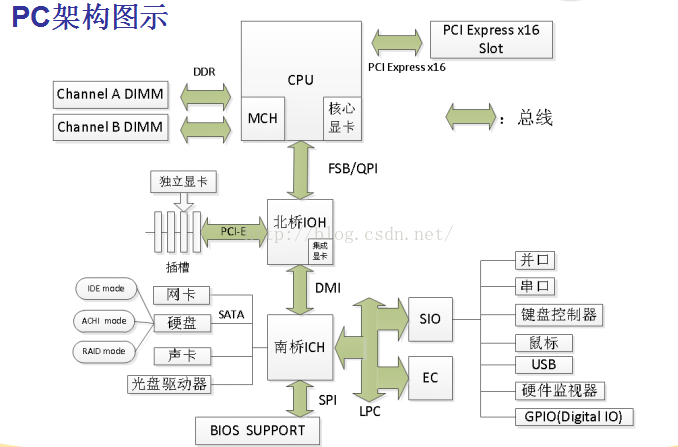
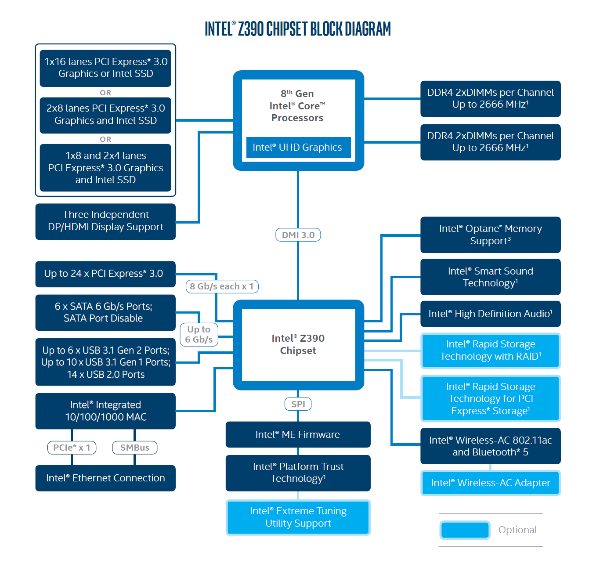

<!--more-->

## Classical model

此图为比较经典的电脑架构图。实际架构根据不同的厂商，主板，平台有所差别。

北桥（North Bridge）：北桥芯片位于 CPU 插座边，起连接作用，用来处理高速信号，例如中央处理器、存储器、显卡（PCI Express 接口或AGP接口），还有与南桥之间的通信。目前已被集成到 CPU 。

南桥（South Bridge）：南桥芯片用于处理低速信号，通过[北桥](https://zh.wikipedia.org/wiki/北桥)与[中央处理器](https://zh.wikipedia.org/wiki/中央處理器)联系。在 旧 Intel 平台中由 ICH 担当。当前 Intel 的 PCH 可看作是南桥。部分 SoC 将 PCH 也集成到 CPU。

SIO （Super I/O）: 一种 I/O 芯片，通过 LPC 总线连接到南桥。集成了 PS/2 键盘、PS/2 鼠标、串口 COM、并口 LPT 接口等处理功能。

SATA（Serial Advanced Technology Attachment）：是一种基于行业标准的串行硬件驱动器接口，是由Intel、IBM、Dell、APT、Maxtor 和 Seagate 公司共同提出的硬盘接口规范。

SPI (Serial Peripheral Interface): 一种高速，全双工，同步通信总线，在芯片的管脚上只占用四根线，节约了芯片的管脚，同时为PCB的布局上节省空间，提供方便，正是出于这种简单易用的特性，如今越来越多的芯片集成了这种通信协议，比如AT91RM9200。
以主从方式工作，通常有一个主设备和一个或多个从设备，需至少4根线，（3根也可，用于单向传输时，也就是半双工方式），它们是 SDI（数据输入）、SDO（数据输出）、SCLK（时钟）、CS（片选）。

BIOS (Basic input output system) : 是一组固化到主板 ROM 芯片的程序，可从 CMOS 中读写系统设置的具体信息，负责提供最底层，最直接的硬件设置和控制功能。

### PCH

 

PCH 全称为 Platform Controller Hub，是 Intel 产品的集成南桥。

北桥的内存控制器和 PCIe 控制器都集成到了 CPU 内部，相当于北桥芯片集成到 CPU 内，主板上只剩下南桥。所以PCH可以理解成南桥。目前 Intel 的有些 SOC 连 PCH 也集成到CPU内，比如：Intel Xeon D系列.

PCH 具有原来 ICH （I/O controller hub） 的全部功能，也具有 MCH (Memory control hub) 的管理引擎功能。

- ICH 负责连接PCI总线、IDE设备、I/O设备等，是 INTEL 的南桥芯片系列名称。
- MCH 相当于北桥芯片，负责连接CPU、AGP总线和 Memory.

DMI (直接媒体接口): 用于连接 CPU 和 PCH 的总线，DMI 2.0 单通道单向传输速率 5GT/s，x4 link 2 GB/s；DMI 3.0 单通道单向传输速率 8GT/s， x4 link 3.93 GB/s。

SMBus (System Management Bus): PCH提供 SMBus 主机控制器以及 SMBus 接口，主机控制器为处理器提供机制以启动与 SMBus 外围设备的通信。

## 参考资料

> - [X86 架构](https://blog.csdn.net/vito_bin/article/details/52748429)
>- [PCH简单介绍](http://blog.sina.com.cn/s/blog_b44234b70102y1da.html)
> - [计算机基础知识-X86架构](https://wenku.baidu.com/view/f8859804f4335a8102d276a20029bd64793e625d.html)
>- [一文看懂arm架构和x86架构有什么区别](http://m.elecfans.com/article/678193.html)
> - [Serial_Peripheral_Interface](https://en.wikipedia.org/wiki/Serial_Peripheral_Interface)

