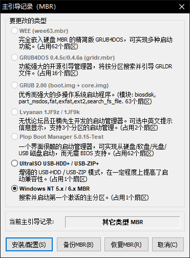

<!--more-->

## BOOTICE

Creating a DOS bootable USB drive with BOOTICE.

- Bootice is free software.
- **Not necessary to format USB drive.**

1. ~~Format your media as FAT32.~~ If it is FAT32 now, don’t need this step.

2. Use **BOOTICE** to install/config MBR and PBR.
  
  
  
  
  
  
  
3. Download the MS-DOS CD image from the following link: <https://winworldpc.com/product/ms-dos/7x>

   

4. Open and uncompress 3 files: **io.sys, msdos.sys, command.com** form image directory `.\Microsoft DOS 7.1 (CD).7z\Microsoft DOS 7.1 (CD)\dos71cd.iso\BOOT\DOS71INS.IMG\` to USB drive root directory by **7-ZIP**.

   

## Rufus

Creating a DOS bootable USB drive with Rufus.

- Rufus is free software.
- Rufus will auto download FreeDOS boot files.
- Will format USB drive.

## UltraISO

Creating a DOS bootable USB drive with Rufus.

- UltraISO is **priced** software.
- Will format USB drive.

## 参考资料

> - [How to Install MS DOS 7.1](https://www.wikihow.com/Install-MS-DOS-7.1)
> - [How to Create a Bootable DOS USB Drive](https://www.howtogeek.com/136987/how-to-create-a-bootable-dos-usb-drive/)
