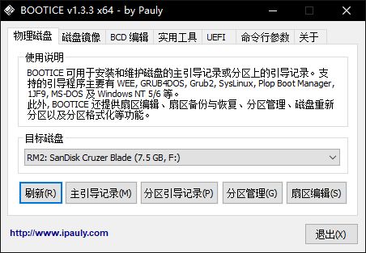
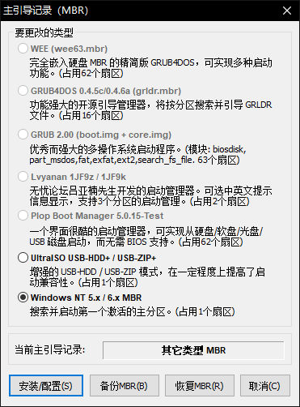
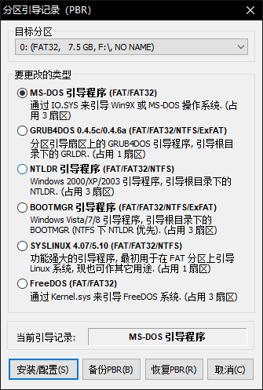
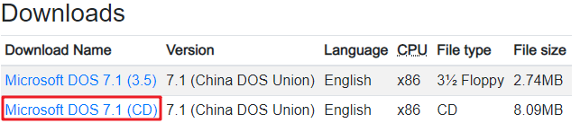
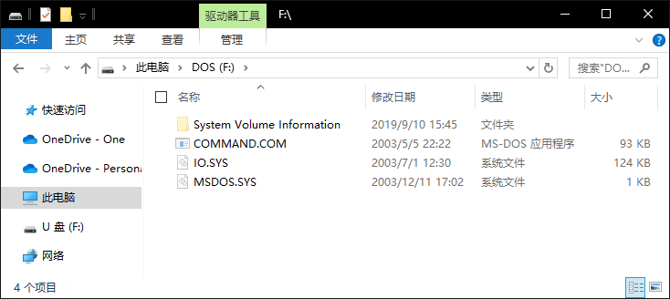

<!--more-->

## Use BOOTICE to create but don’t need format

Creating a DOS bootable USB drive with BOOTICE, Not necessary to format USB drive.

1. ~~Format your media as FAT32.~~ If it is FAT32 now, don’t need this step.

2. Use **BOOTICE** to install/config MBR: Windows NT 5.x /6.x  and PBR: MS-DOS.
  
  
  
  
  
  
  
3. Download the MS-DOS CD image from the following link: https://winworldpc.com/product/ms-dos/7x

   

4. Open and uncompress 3 files: **io.sys, msdos.sys, command.com** form image directory `.\Microsoft DOS 7.1 (CD).7z\Microsoft DOS 7.1 (CD)\dos71cd.iso\BOOT\DOS71INS.IMG\` to USB drive root directory by **7-ZIP**.

   

## 参考资料

> - [How to Install MS DOS 7.1](https://www.wikihow.com/Install-MS-DOS-7.1)]