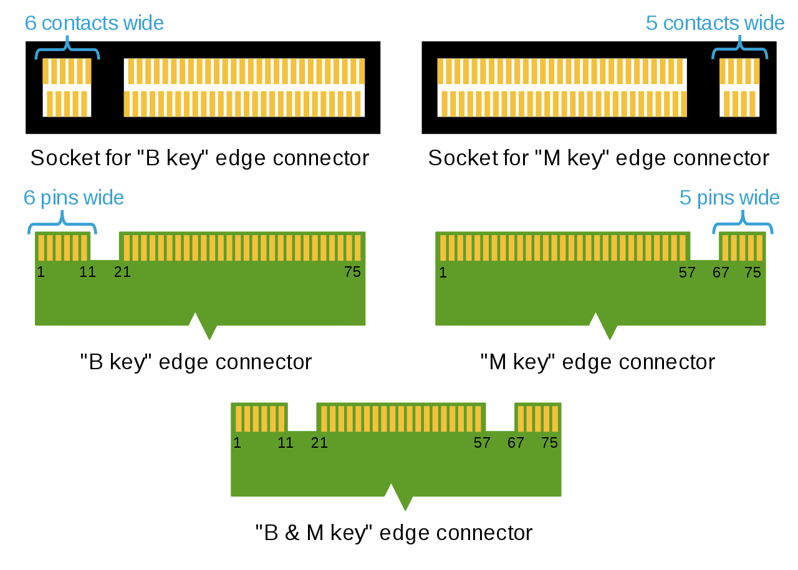

## For Storage

### Storage interfaces

Legacy SATA

PCI Express using AHCI

PCI Express using NVMe

B Key: SATA, PCI-E x2

M Key: SATA, PCI-E x2, x4

## For Wireless & Bluetooth

###Interface

PCI-E x1

USB

## Keys and Sockets

| **Key ID** | **Pin Location** |                        **Interface**                         |
| :--------: | :--------------: | :----------------------------------------------------------: |
|   **A**    |       8-15       |              2x PCIe x1 / USB 2.0 / I2C / DP x4              |
|   **B**    |      12-19       | PCIe x2 / SATA /USB 2.0 / USB 3.0 / HSIC / SSIC / Audio / UIM / I2C |
|   **C**    |      16-23       |                   Reserved for Future Use                    |
|   **D**    |      20-27       |                   Reserved for Future Use                    |
|   **E**    |      24-31       |        2x PCIe x1 / USB 2.0 / I2C / SDIO / UART / PCM        |
|   **F**    |      28-35       |                Future Memory Interface (FMI)                 |
|   **G**    |      39-46       |        Not Used for M.2; for Custom/Non-Standard Apps        |
|   **H**    |      43-50       |                   Reserved for Future Use                    |
|   **J**    |      47-54       |                   Reserved for Future Use                    |
|   **K**    |      51-58       |                   Reserved for Future Use                    |
|   **L**    |      55-62       |                   Reserved for Future Use                    |
|   **M**    |      59-66       |                        PCIe x4 / SATA                        |

## Size

2230, 

2242, 

2280, 22 x 80 x3.58 mm 

22110

## 参考资料

> “[M.2 SSDs: Big Performance Comes in Small Packages](https://www.atpinc.com/blog/what-is-m.2-M-B-BM-key-socket-3)”