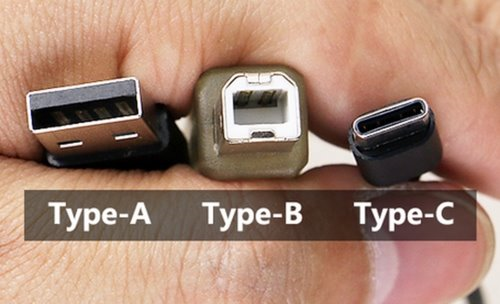
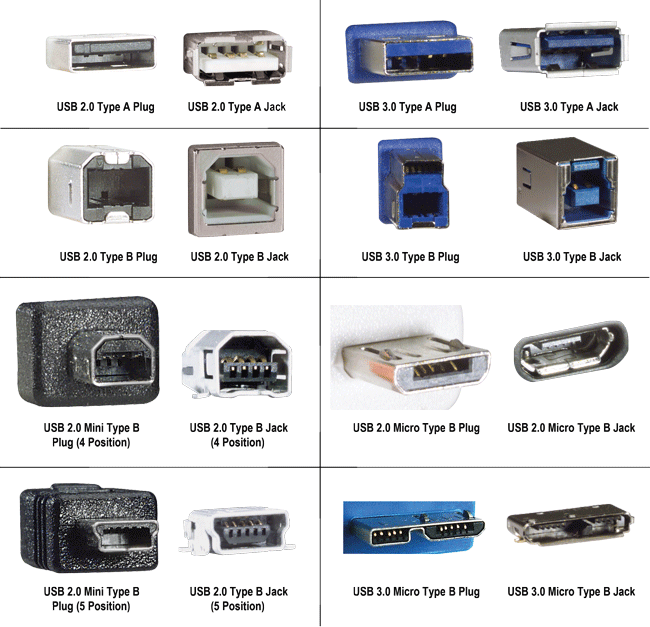

<!--more-->

## Universal Serial Bus

| Revision                                   | Data rate               | Speed     | Coding    | Actual Speed | Max. Cable Length | Release |
| ------------------------------------------ | ----------------------- | --------- | --------- | ------------ | ----------------- | ------- |
| USB 1.0                                    | 1.5 Mbps  12 Mbit/s | 192 KB/s  | 8b/10b    |              |                   | 1996    |
| USB 1.1                                    | 12 Mbit/s               | 1536 KB/s | 8b/10b    |              | 5 M               | 1998    |
| USB 2.0                                    | 480 Mbit/s              | 60 MB/s   | 8b/10b    | 48 MB/s      | 5 M               | 2001    |
| USB 3.0 USB 3.1 Gen 1 USB 3.2 Gen1 | 5 Gbit/s                | 640 MB/s  | 8b/10b    | 512 MB/s     | 5 M               | 2011    |
| USB 3.1 Gen  2 USB 3.2 Gen 2           | 10 Gbit/s               | 1280 MB/s | 128b/132b | ~ 1241 MB/s  |                   | 2014    |
| USB 3.2 USB 3.2 Gen 2 x 2              | 20 Gbit/s               | 2560 MB/s |           |              |                   | 2017    |
| USB 4                                      | 40 Gbit/s               | 5120 MB/s |           |              |                   | 2019    |

### USB 3.1 Gen2

- Encode scheme: 128b/132b, line encode overhead: 3% ;
- If Support USB Power Delivery 1.0/2.0, Max power: 20 V x 5 A = 100 W ;
- Add Type-C connector;

## Connectors

## Power

### USB power standards

|                        Specification                         |                           Current                            |                           Voltage                            | Power (max.) |
| :----------------------------------------------------------: | :----------------------------------------------------------: | :----------------------------------------------------------: | :----------: |
|                       Low-power device                       |                            100 mA                            | 5 V[[a\]](https://en.wikipedia.org/wiki/USB#cite_note-Vdrop-81) |    0.50 W    |
|            Low-power SuperSpeed (USB 3.0) device             |                            150 mA                            | 5 V[[a\]](https://en.wikipedia.org/wiki/USB#cite_note-Vdrop-81) |    0.75 W    |
|                      High-power device                       | 500 mA[[b\]](https://en.wikipedia.org/wiki/USB#cite_note-82) |                             5 V                              |    2.5 W     |
|            High-power SuperSpeed (USB 3.0) device            | 900 mA[[c\]](https://en.wikipedia.org/wiki/USB#cite_note-83) |                             5 V                              |    4.5 W     |
|         Multi-lane SuperSpeed (USB 3.2 Gen 2) device         | 1.5 A[[d\]](https://en.wikipedia.org/wiki/USB#cite_note-84)  |                             5 V                              |    7.5 W     |
|                  Battery Charging (BC) 1.2                   |                            1.5 A                             |                             5 V                              |    7.5 W     |
|                            USB-C                             |                            1.5 A                             |                             5 V                              |    7.5 W     |
|                             3 A                              |                             5 V                              |                             15 W                             |              |
|                 Power Delivery 2.0 Micro-USB                 |                             3 A                              |                             20 V                             |     60 W     |
| Power Delivery 2.0 Type-A/B/C[[e\]](https://en.wikipedia.org/wiki/USB#cite_note-req_5A_cable-85) |                             5 A                              |                             20 V                             |    100 W     |
| ^ [Jump up to:***a***](https://en.wikipedia.org/wiki/USB#cite_ref-Vdrop_81-0) [***b***](https://en.wikipedia.org/wiki/USB#cite_ref-Vdrop_81-1) The VBUS supply from a low-powered hub port may drop to 4.40 V.**^** Up to five unit loads; with non-SuperSpeed devices, one unit load is 100 mA.**^** Up to six unit loads; with SuperSpeed devices, one unit load is 150 mA.**^** Up to six unit loads; with multi-lane devices, one unit load is 250 mA.**^** Requires active PD 5 A cable. |                                                              |                                                              |              |

### Power-related specifications

|                 Release name                  | Release date | Max. power |                             Note                             |
| :-------------------------------------------: | :----------: | :--------: | :----------------------------------------------------------: |
|           USB Battery Charging 1.0            |  2007-03-08  |  5 V, ? A  |                                                              |
|           USB Battery Charging 1.1            |  2009-04-15  | 5 V, 1.8 A |   [[41\]](https://en.wikipedia.org/wiki/USB#cite_note-41)    |
|           USB Battery Charging 1.2            |  2010-12-07  |  5 V, 5 A  |   [[42\]](https://en.wikipedia.org/wiki/USB#cite_note-42)    |
| USB Power Delivery revision 1.0 (version 1.0) |  2012-07-05  | 20 V, 5 A  |           Using FSK protocol over bus power (VBUS)           |
| USB Power Delivery revision 1.0 (version 1.3) |  2014-03-11  |     ?      |                                                              |
| USB Power Delivery revision 2.0 (version 1.0) |  2014-08-11  | 20 V, 5 A  | Using BMC protocol over communication channel (CC) on USB-C cables. |
|                   USB-C 2.0                   |  2014-08-11  |  5 V, 3 A  |            New connector and cable specification             |
|                   USB-C 4.2                   |  2015-04-03  |  5 V, 3 A  |                                                              |
| USB Power Delivery revision 2.0 (version 1.1) |  2015-05-07  | 20 V, 5 A  |                                                              |
| USB Power Delivery revision 2.0 (version 1.2) |  2016-03-25  | 20 V, 5 A  |                                                              |
| USB Power Delivery revision 2.0 (version 1.3) |  2017-01-12  | 20 V, 5 A  |                                                              |
| USB Power Delivery revision 3.0 (version 1.1) |  2017-01-12  | 20 V, 5 A  |                                                              |
| USB Power Delivery revision 3.0 (version 1.2) |  2018-06-21  | 20 V, 5 A  |   [[43\]](https://en.wikipedia.org/wiki/USB#cite_note-43)    |

## 参考资料

> - [USB3.1最新技术及测试方案](https://wenku.baidu.com/view/749990058e9951e79a892758.html)
> - [USB (Universal Serial Bus) Tutorial](http://www.l-com.com/content/USB-Tutorial.html)
> - [USB](https://en.wikipedia.org/wiki/USB)
