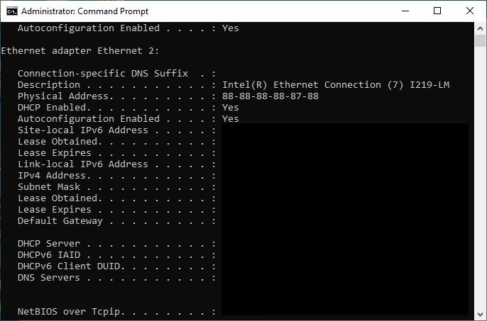
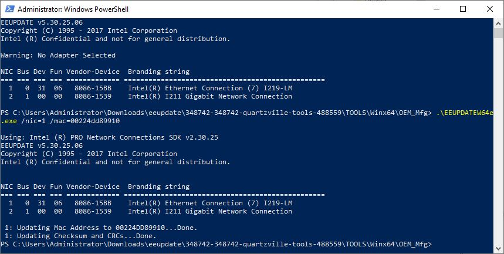
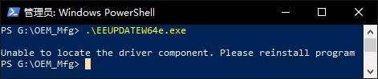

<!--more-->

## eeupdate

```commonlisp

Using: Intel (R) PRO Network Connections SDK v2.30.25
EEUPDATE v5.30.25.06 
Copyright (C) 1995 - 2017 Intel Corporation
Intel (R) Confidential and not for general distribution.
-----------------------------------------------------
Options:
    /HELP or /?
       Displays command line help.
    /EXITCODES
       Displays exit code help.
    /ALL
       Selects all adapters found in the system.
    /NIC=XX
       Selects a specific adapter (1-32).
    /BUS=XX
       Selects PCI bus of adapter to program. Must be used with the DEV
       parameter to specify an adapter.
    /DEV=XX
       Selects PCI device of the adapter to program. Must be used with the
       BUS parameter to specify an adapter.
    /FUN=XX
       Selects PCI function of the adapter to program. Must be used with both
       the BUS and DEV parameters to specify an adapter.
Press <Enter> to continue...
    /DEVICE=<pci device ID>
       4 hex digit device id of card to program.
    /SUBDEVICE=<pci subsystem device ID>
       4 hex digit subsystem device id of card to program.
    /DUMP
       Dumps EEPROM/Shadow RAM memory contents to        file *.eep and flash memory to *.bin (if available)
    /MAC_DUMP_FILE
       Dumps the MAC address to a file usable by the /A command.
    /MAC_DUMP
       Displays the adapter LAN MAC address.
    /MAC_DUMP_ALL
       Displays all the MAC addresses.
    /MAC_ALL_TO_FILE
       Dumps all the MAC addresses to a file usable by the /MAC_ALL_FROM_FILE
       command.
    /MAC_ALL_FROM_FILE <addrfile>
       Programs all MAC addresses from text file to a device.
       File should contain 13 MAC addresses (9 for PEPs and
       4 custom MAC addresses), one each line. EUI48 and EUI64 formats accepted.
    /CB <offset> <bitmask>
       Clears bits in the EEPROM, specified in <bitmask>.
    /SB <offset> <bitmask>
       Sets bits in the EEPROM, specified in <bitmask>.
Press <Enter> to continue...
    /RW <word>
       Reads <word> from the EEPROM.
    /WW <word> <value>
       Writes <value> into <word> in EEPROM.
    /MAC=macaddr [/NUM=PF_num]
       Programs the EEPROM/NVM with only the MAC address of
       macaddr without changing the rest of the EEPROM/NVM.
       /NUM is optional and I40E specific - it defines target PF.
    /A <addrfile> or /address <addrfile>
       Programs the EEPROM/NVM with only the MAC address from
       the <addrfile> without changing the rest of the
       EEPROM.
    /D <imagefile> or /DATA <imagefile>
       Programs the NVM [EEPROM/FLASH] with the contents of <imagefile>
       without changing the MAC address.
    /PHYNVM <imagefile>
       Programs the PHY NVM with the contents of <imagefile>

    /DEBUG
       Forces debug update to be used where applicable.
       Must be used with /D or /DATA switch.
    /CALCCHKSUM
       Forces the EEPROM checksum and CRCs to be updated.
Press <Enter> to continue...
    /EEPROMVER
       Displays the version of the EEPROM image.
    /INVMVERSION
       Displays the version of the iNVM image.
    /PCIINFO
       Displays the PCI information of the adapter.
    /ADAPTERINFO
       Displays additional information about the adapter, such as EtrackID,
       PF MAC address, or image and firmware version.
    /TEST
       Checks the EEPROM/NVM checksum(s) and size.
    /IDFLASH
       Displays the flash ID and its protected status.
    /VERSION
       Displays version and the diagnostic library information.
    /PHYID <imagefile>
       Programs the PHY ID NVM with the contents of <imagefile>.
    /PHYID_DUMP
       Dumps PHY ID NVM contents to a file with the name:       <PHY ID>_<PHY card version>.bin
    /PHYID_VERIFY <targetfile> 
       Verifies the PHY ID NVM image in eeprom against the file
       specified in <targetfile>.
Press <Enter> to continue...
    /FLASH_DUMP <targetfile> 
       Dumps contents of the whole flash memory of
       selected adapters to *.bin file

    /EEPROM_DUMP
       Dumps contents of the EEPROM/Shadow RAM memory of
       selected adapters to *.eep file
    /GUI
       Brings up GUI mode.
    /GUI /HELP
       Displays GUI help.
    /NOPROT
       When programming an image for devices that support NVM protection,
       prevents protection from being enabled. This switch must be used
       with the /DATA command and has no effect on NVM devices that are
       already protected.
    /DEBUGLOG <debugfile>
       Log debug messages into the debugfile.
    /VERIFY <targetfile>
       Verifies the eeprom/NVM image in eeprom/NVM to the target file
       specified in <targetfile>.
Press <Enter> to continue...
    /CHECKIMAGE
       Verifies that the NVM in <imagefile> can be loaded over the running NVM.
    /VERIFYPHYNVM <targetfile>
       Verifies the PHY NVM image in eeprom to the target file
       specified in <targetfile>.
    /ADAPTERRESET
       Reset the adapter.
       *CAUTION* This will unload the driver for this device if present.
    /SANMAC_DUMP [/NUM=PF_num]
       Displays the dedicated MAC address for the SAN.
       /NUM is optional and i40e specific - it defines target PF.
    /SANMAC=macaddr [/NUM=PF_num]
       Programs the dedicated SAN MAC address withoutchanging the rest of
       the EEPROM. /NUM is optional and i40e specific - it defines target PF.
    /SANADDRESS <addrfile>
       Programs the dedicated SAN MAC address with the
       MAC address from <addrfile>.
    /INVMVERIFY /FILE=<[path\]filename>]
       Compares autoload configuration stored in OTP memory
       with the configuration defined in configuration file.
    /INVMTEST /FILE=<[path\]filename>]
       Report number of free space left in INVM if autoload configuration
       defined in configuration file would be applied.
Press <Enter> to continue...
    /INVMUPDATE /FILE=<[path\]filename>]
       Write new autoload configuration defined in Raw (*.raw) configuration
       file to empty INVM or updates current autoload configuration stored in
       INVM based on 'human readable' configuration file.
    /INVMISLOCKED
       Checks if autoload configuration stored in OTP
       memory is protected against write attempts.
    /INVMLOCK
       Sets unique record in autoload configuration stored in INVM
       protecting its content against further updates.
    /INVMGET
       Dumps autoload configuration stored in INVM to file
       with predefined name <mac address hex string>.otp.
    /FORCE
       Omits any warnings and forces command execution.
    /KEEPCONFIG
       This option lets you keep config words while upgrading eeprom.
    /PORT_MAC=macaddr /NUM=Port_num
       Programs the dedicated Port MAC address without
       changing the rest of the EEPROM.
    /PORT_MAC_DUMP /NUM=Port_num
       Display the adapter port MAC address.
Press <Enter> to continue...
    /CUSTOM_MAC mac_number mac_addr
       Programs the given custom mac address number [0-3] without
       changing the rest of the NVM (EUI48 and EUI64 formats supported).
    /SERIAL_MAC=macaddr
       Programs the dedicated PCIe serial MAC address without
       changing the rest of the EEPROM.
    /SERIAL_MAC_DUMP
       Display the adapter PCIe serial MAC address.
    /PF_MAC=macaddr /NUM=PF_num
       Programs the dedicated MAC address of a specified Physical Function
       This allows altering the mac addresses of inactive functions of a
       visible NIC.
    /PF_MAC_DUMP /NUM=PF_num
       Display MAC address of a selected Physical Function of the
       specified NIC. This allows dumping MAC addresses of inactive functions
       of a visible device. 
    /MNG_MAC=macaddr /NUM=MNG_num
       Programs the dedicated MAC address of a specified Manageability Function
       This allows altering the mac addresses of inactive functions of a
       visible NIC.
    /MNG_MAC_DUMP /NUM=MNG_num
       Display MAC address of a selected Manageability Function of the
       specified NIC. This allows dumping MAC addresses of inactive functions
       of a visible device. 
    /RO <imagefile>
       Programs RO words in EEPROM/SR with values taken from RO Module binary
       file.

```


### MAC address

If flash BIOS by Intel FPT tool not as `fpt -f xxx.bin -savemac`. The MAC address for Intel I219 adapter will be missing, and mark as 88-88-88-88-87-88 .



Users can use `eeupdate` to flash the MAC address during DOS/EFI Shell/Windows environment.  Command as `eeupdate /nic=x /mac=xxxxxx`.



If the Computer don’t have Intel adapter, it will prompt others message.



## 参考资料

> - [Network Connections Tools - Intel Design in Tools](https://designintools.intel.com/Network_Connections_Tools_p/stlgrn108.htm)
> - [Ethernet controller I210 I211](https://www.intel.com/content/dam/www/public/us/en/documents/faqs/ethernet-controller-i210-i211-faq.pdf)
