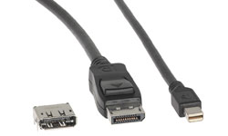
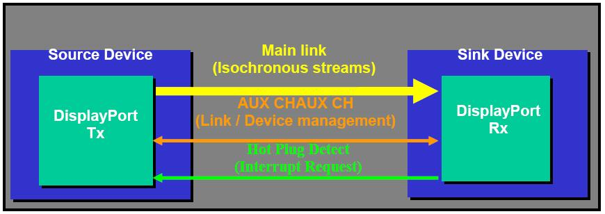
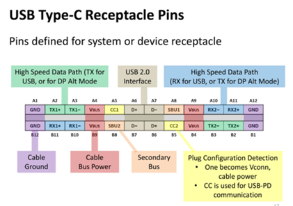
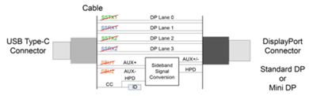
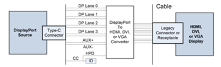
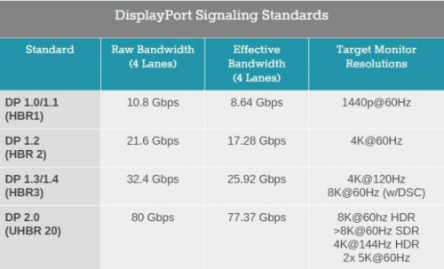
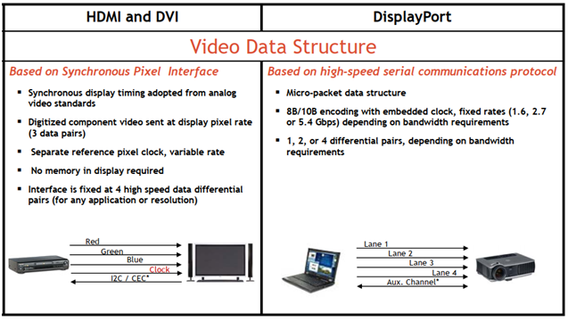

# DP

DisplayPort

## Interface

## Channels

Main Link:   
Each main link comprises 1, 2 or 4 AC-coupled, doubly terminated differential pairs (lanes) with no dedicated clock signal, which is embedded in the 8b/10b coded data stream.   

AUX CH: Auxiliary Channel, 1 lane for 

Hot Plug Detect

## Features

|                                                              | DisplayPort version |                       |                       |                        |                        |                        |
| :----------------------------------------------------------- | :------------------ | :-------------------: | :-------------------: | :--------------------: | :--------------------: | ---------------------- |
|                                                              | 1.0                 |       1.1-1.1a        |       1.2-1.2a        |          1.3           |          1.4           | 2.0                    |
| Hot-pluggable                                                | Yes                 |          Yes          |          Yes          |          Yes           |          Yes           | Yes                    |
| Inline audio                                                 | Yes                 |          Yes          |          Yes          |          Yes           |          Yes           | Yes                    |
| DisplayPort content protection (DPCP)                        | DPCP 1.0            |       DPCP 1.0        |       DPCP 1.0        |        DPCP 1.0        |        DPCP 1.0        | DPCP 1.0               |
| High-bandwidth digital content protection ([HDCP](https://en.wikipedia.org/wiki/HDCP)) | No                  |       HDCP 1.3        |       HDCP 1.3        |        HDCP 2.2        |        HDCP 2.2        | HDCP 2.2               |
| Dual-mode (DP++)                                             | No                  |          Yes          |          Yes          |          Yes           |          Yes           | Yes                    |
| Maximum DP++ bandwidth (TMDS Clock)                          | N/A                 | 4.95 Gbit/s (165 MHz) | 9.00 Gbit/s (300 MHz) | 18.00 Gbit/s (600 MHz) | 18.00 Gbit/s (600 MHz) | 18.00 Gbit/s (600 MHz) |
| Stereoscopic 3D video                                        | No                  |          Yes          |          Yes          |          Yes           |          Yes           | Yes                    |
| Multi-stream transport (MST)                                 | No                  |          No           |          Yes          |          Yes           |          Yes           | Yes                    |
| High-dynamic-range video (HDR)                               | No                  |          No           |          No           |           No           |          Yes           | Yes                    |
| Display stream compression (DSC)                             | No                  |          No           |          No           |           No           |        DSC 1.2         | DSC 1.2a               |
| Panel replay                                                 | No                  |          No           |          No           |           No           |           No           | Yes                    |

### DisplayPort dual-mode (DP++)

Optional feature.

Allows DisplayPort sources to use simple **passive** adapters to connect to HDMI or DVI displays.

Devices which implement dual-mode will detect that a DVI or HDMI adapter is attached, and send DVI/HDMI TMDS signals instead of DisplayPort signals. 

DP++ V1.0, used in DP V1.1, TMDS clock speeds of up to 165 MHz (4.95 Gbit/s bandwidth). HDMI 1.2, 1920 x 1080, 1920 x 1200 60 Hz.

DP++ v1.1, used in DP V1.2, TMDS clock speeds of up to 300 MHz (9.00 Gbit/s). This is slightly less than the 340 MHz maximum of HDMI 1.4, and is sufficient for up to 1920 × 1080 at 120 Hz, 2560 × 1440 at 60 Hz, or 3840 × 2160 at 30 Hz.

DP++ v1.?, used in DP V1.3, TMDS clock speeds of up to 600 MHz (18.00 Gbit/s). The full bandwidth of HDMI 2.0. This is sufficient for 1920 × 1080 at 240 Hz, 2560 × 1440 at 144 Hz, or 3840 × 2160 at 60 Hz.

Older adapters, which were only capable of the 165 MHz speed, were retroactively termed "Type 1" adapters, with the new 300 MHz adapters being called "Type 2".

####  Limitation

1. Single-link DVI only.
2. Unavailable on USB-C.
3. Limited adapter speed. The signals are transmitted at DisplayPort's native voltage (3.3 V) instead of the 5 V used by DVI and HDMI. 
4. Unidirectional. DVI or HDMI to DP need **active** conversion device.

### Multi-Stream Transport (MST)

DP 1.2 and newer.

It allows multiple independent displays to be driven from a single DP port on the source devices by [multiplexing](https://en.wikipedia.org/wiki/Multiplexing) several video streams into a single stream and sending it to a *branch device*, which demultiplexes the signal into the original streams.

MST hub. (For example: StarTech MSTDP124DP DisplayPort MST(multi-stream) hub)

Supported by USB Type-C DisplayPort Alternate Mode, so standard DisplayPort daisy-chains and MST hubs do function from Type-C sources with a simple Type-C to DisplayPort adapter.

DisplayPort-to-DVI and DisplayPort-to-HDMI adapters/cables may or may not function from an MST output port.

Maximum 63 displays, the maximum number of links between the source and any device is 7, the maximum number of physical output ports on each branch device is 7.

#### Daisy-chain

DP monitor have dedicated DisplayPort output port. (For example: DELL U2417H)

### DisplayPort Alternate Mode over USB Type-C

### High dynamic range (HDR)

Support for HDR video was introduced in DisplayPort 1.4. It implements the CTA 861.3 standard for transport of static HDR metadata in EDID.

### DisplayPort Content protection (DPCP)

DP V1.1, HDCP 1.3.

DisplayPort 1.3 added support for HDCP 2.2, which is also used by HDMI 2.0.

## Link Symbol Rate

|                                                              | 1.1-1.1a        | 1.2-1.2a     | 1.3          | 1.4                                       | 2.0          |
| :----------------------------------------------------------- | --------------- | ------------ | ------------ | ----------------------------------------- | :----------- |
| **Main link**                                                |                 |              |              |                                           |              |
| Transmission modes:                                          |                 |              |              |                                           |              |
| RBR (1.62 Gbit/s per lane)                                   | Yes             | Yes          | Yes          | Yes                                       | Yes          |
| HBR (2.70 Gbit/s per lane)                                   | Yes             | Yes          | Yes          | Yes                                       | Yes          |
| HBR2 (5.40 Gbit/s per lane)                                  | No              | Yes          | Yes          | Yes                                       | Yes          |
| HBR3 (8.10 Gbit/s per lane)                                  | No              | No           | Yes          | Yes                                       | Yes          |
| UHBR 10 (10.0 Gbit/s per lane)                               | No              | No           | No           | No                                        | Yes          |
| UHBR 13.5 (13.5 Gbit/s per lane)                             | No              | No           | No           | No                                        | Yes          |
| UHBR 20 (20.0 Gbit/s per lane)                               | No              | No           | No           | No                                        | Yes          |
| Number of lanes                                              | 4               | 4            | 4            | 4                                         | 4            |
| Maximum total bandwidth[[a\]](https://en.wikipedia.org/wiki/DisplayPort#cite_note-bandwidth-40) | 10.80 Gbit/s    | 21.60 Gbit/s | 32.40 Gbit/s | 32.40 Gbit/s                              | 80.00 Gbit/s |
| Maximum total data rate[[b\]](https://en.wikipedia.org/wiki/DisplayPort#cite_note-datarate-41) | 8.64 Gbit/s     | 17.28 Gbit/s | 25.92 Gbit/s | 25.92 Gbit/s                              | 77.37 Gbit/s |
| Encoding scheme[[c\]](https://en.wikipedia.org/wiki/DisplayPort#cite_note-encoding-42) | (§1.7.1) 8b/10b | 8b/10b       | 8b/10b       | 8b/10b                                    | 128b/132b    |
| Compression (optional)                                       | -               | -            | -            | DSC 1.2 (DP 1.4)  DSC 1.2a (DP 1.4a) | DSC 1.2a     |

## Resolution

##HDMI & DVI vs DP

## 参考资料

> - [DisplayPort](https://zh.wikipedia.org/wiki/DisplayPort)
> - [视频基本原理 -视频接口之 - DP接口 （二）](https://ydaobo.com/wenzhang/4921.html)
> - [Testing DisplayPort v1.2 at 5.4Gbps on PS3600](https://docplayer.net/52407530-Testing-displayport-v1-2-at-5-4gbps-on-ps3600.html)