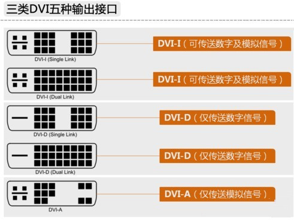
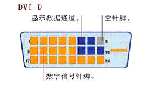
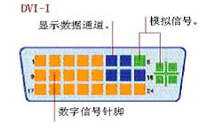

Digital Visual Interface

## Interface

## Resolution

DVI-I Single Link max resolution: 1920x1200, 60Hz

DVI-I Dual Link max resolution: 2560x1600, 60Hz/1920x1200, 120Hz

DVI-D Single Link max resolution: 1920x1200, 60Hz

DVI-D Dual Link max resolution: 2560x1600, 60Hz or 1920x1080, 120Hz

## Bitrate

Single link: 3.96 Gbit/s 
Dual link: 7.92 Gbit/s

## Cable length

The maximum length recommended for DVI cables is not included in the specification.

In general, cable lengths up to 4.5 meters will work for display resolutions up to 1920 × 1200.

Longer cables up to 15 meters in length can be used with display resolutions 1280 × 1024 or lower.

## Characteristic

1、数字信号，避免了模/数转换过程，信号没有衰减，色彩更纯净、逼真。

2、Don’t support transmit audio.

3、Support HDCP.
