<!--more-->

## 双击可执行文件

## CMD 下静默安装

在 Windows CMD 通过类似 `setup.exe -s` 命令在后台安装，具体查看相关驱动的文档。

## Windows update

   1. Windows update 推送，比如 Graphic Driver；

   2. 点击 自动搜索更新的驱动程序软件 ；

      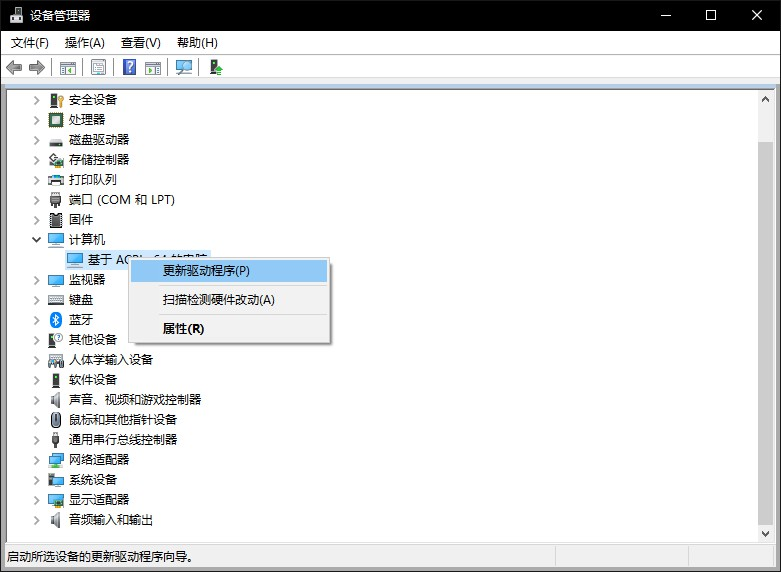

      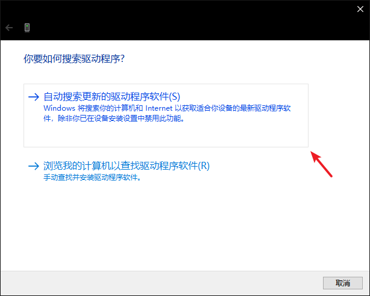

## 通过 `.inf`[^1] 文件安装

   1. 右键点选安装;   
      以 PASSMARK USB 3.0 Loopback 为例：
      
      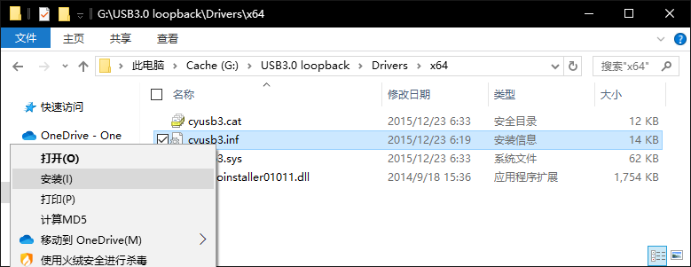

   2. 手动添加安装;  
      以并口打印机为例：
      
      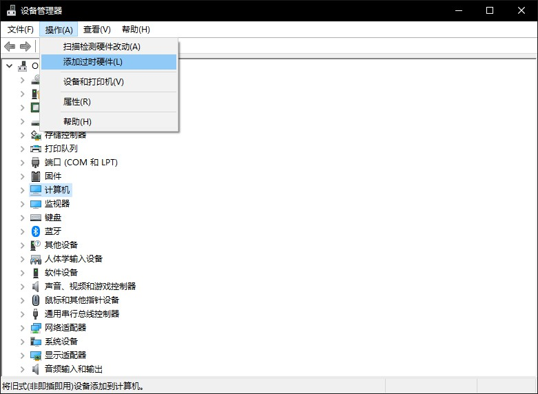
      
      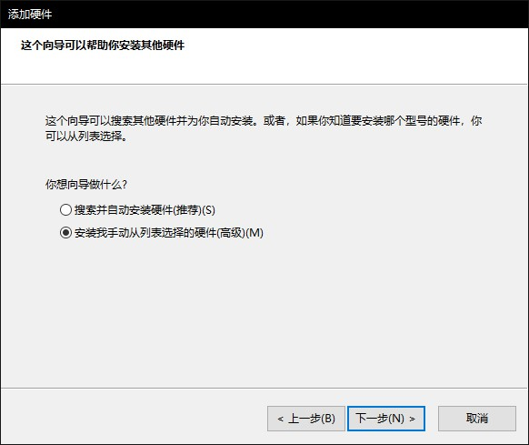
      
      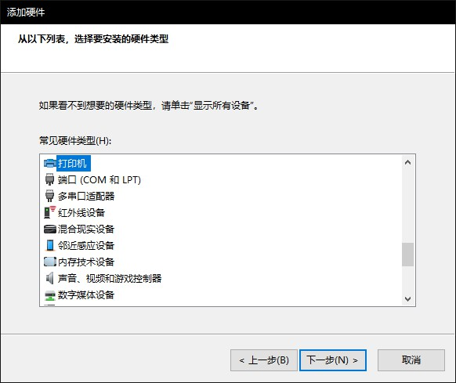
      
      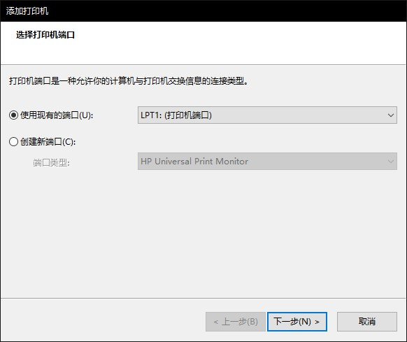
      
      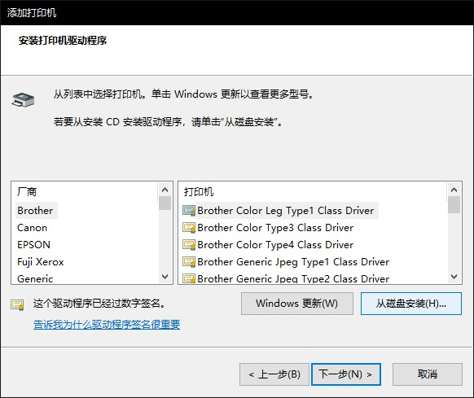
      
      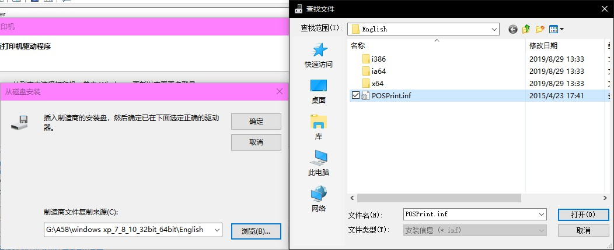
      
      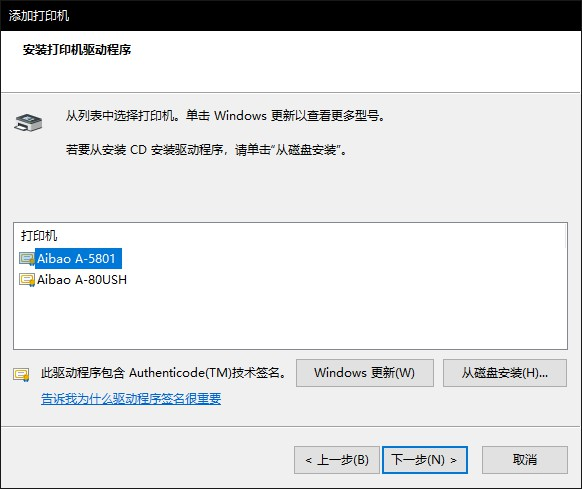
      
      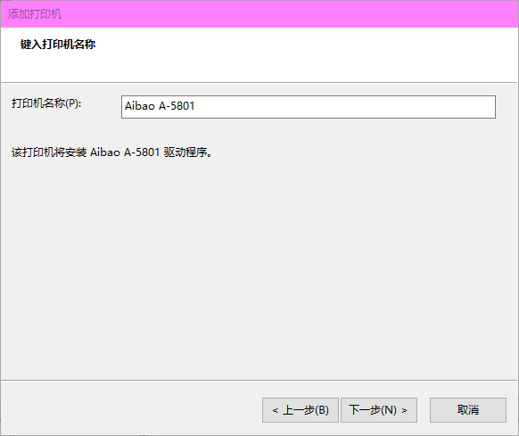
      
      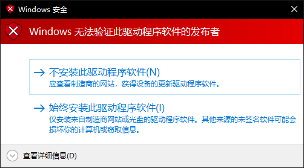
      
      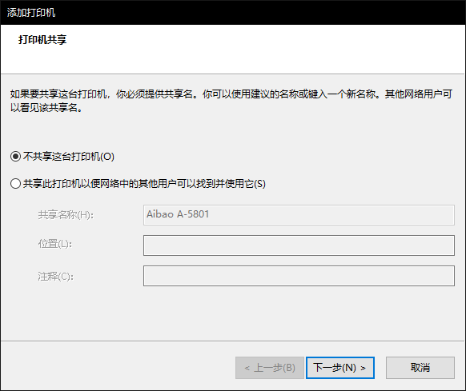
      
      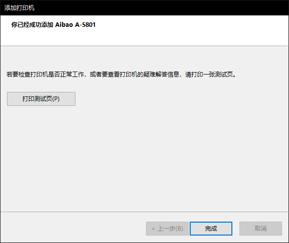

## 参考资料

[^1]: INF是Device INFormation File的英文缩写，是Microsoft公司为硬件设备制造商发布其驱动程序推出的一种文件格式，INF文件中包含硬件设备的信息或脚本以控制硬件操作。在INF文件中指明了硬件驱动该如何安装到系统中，源文件在哪里、安装到哪一个文件夹中、怎样在注册表中加入自身相关信息等等。

